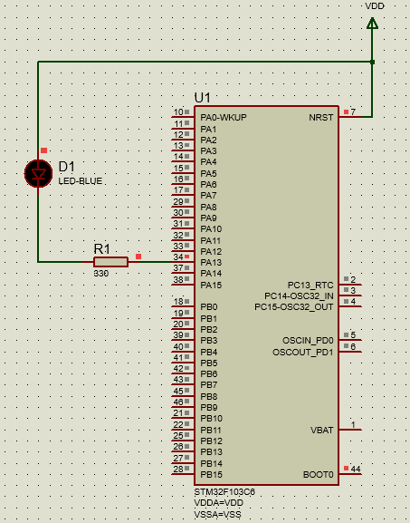

# Toggling an LED using an arbitrary delay

* This is a simple project just to toggle an LED on and off with a software delay using STM32F103C6 micro controller.

* The code was tested on a simulation made on Proteus Software.

