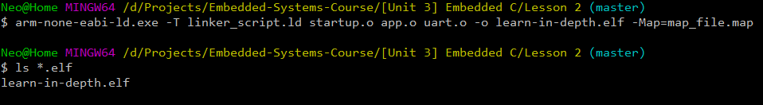
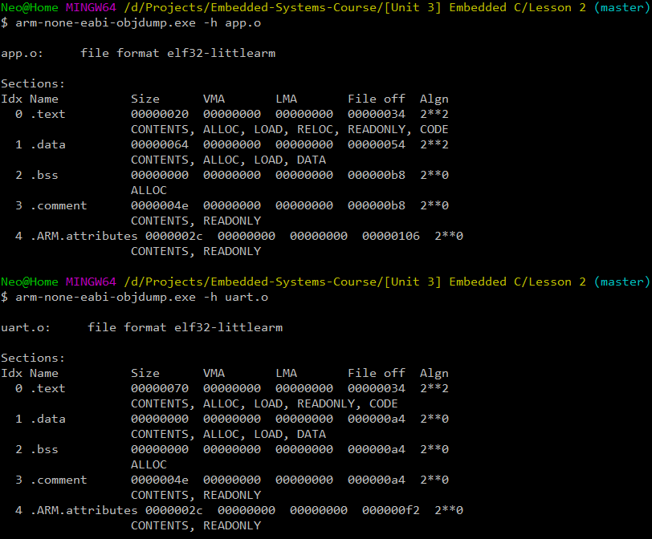

# Writing a baremetal software from scratch

In this lesson, a very baisc baremetal software for the uart peripheral of the versatilePB on Qemu emulator will be written, built and tested without any ready made startup or linker script files to send a string to the console.

---

## Dependencies

* [GNU Arm Embedded Toolchain](https://developer.arm.com/tools-and-software/open-source-software/developer-tools/gnu-toolchain/gnu-rm)
* [Qemu Emulator](https://www.qemu.org/)

---

## Build Process

* **Compiling the C files without linking and generating the object files:**
```bash
arm-none-eabi-gcc.exe -mcpu=arm926ej-s -c "directory path"/Src/app.c -I "directory path"/Inc/. -o app.o
arm-none-eabi-gcc.exe -mcpu=arm926ej-s -c "directory path"/Src/uart.c -I "directory path"/Inc/. -o uart.o
```


* **Compiling the startup file and generating the object file:**
```bash
arm-none-eabi-as.exe -mcpu=arm926ej-s startup.s -o startup.o
```


* **Linking the the object files and generating the .elf file and the .map file:**

```bash
arm-none-eabi-ld.exe -T linker_script.ld startup.o app.o uart.o -o learn-in-depth.elf -Map=map_file.map
```


* **Generating the binary file for Qemu:**
```bash
arm-non-eabi-objcopy.exe -O binary learn-in-depth.elf learn-in-depth.bin
```


---

## Running the binary on Qemu:

Make sure to add the path of the Qemu installation directory to the environment variables or run from the installation path.

```bash
qemu-system-arm -M versatilepb -m 128M -nographic -kernel learn-in-depth.bin
```


---

## Analyzing the output files:

* **Chekcing the relocatable memory sections of the C files:**
```bash
arm-none-eabi-objdump.exe -h app.o
arm-none-eabi-objdump.exe -h uart.o
```


* **Checking the relocatable memory sections of the startup file:**
```bash
arm-none-eabi-objdump.exe -h startup.o
```


* **Checking the symbol tabel of all object files before linkage:**
```bash
arm-none-eabi-nm.exe app.o
arm-none-eabi-nm.exe uart.o
arm-none-eabi-nm.exe startup.o
```


* **Checking the locatable memory sections of the final output (.elf) file:**
```bash
arm-none-eabi-objdump.exe -h learn-in-depth.elf
```


* **checking the symbol table of the final output (.elf) file:**
```bash
arm-none-eabi-nm.exe learn-in-depth.elf
```
