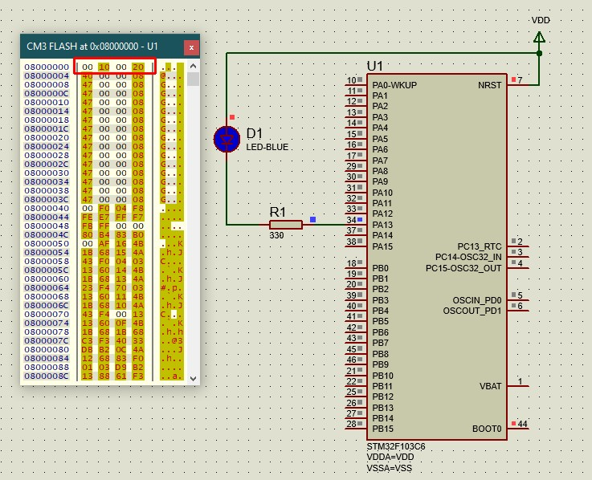

# Lab 3 - Part 1: Automating the build process

## In this lab, we are going to: 
* Write our own simple startup file and linker script for the St32F103C6 Arm Cortex-M3 based microcontroller.
* Reusing the lab 1 baremetal software that was already written to toggle an LED.
* And finally writing a makefile to automate the build process with GNU make.

---

## Dependencies

* [GNU Arm Embedded Toolchain](https://developer.arm.com/tools-and-software/open-source-software/developer-tools/gnu-toolchain/gnu-rm)
* [GNU make](https://www.gnu.org/software/make/)

---

## GNU make

* Unlike the previous lab where I had to write every command to build our source code, this time I used GNU make to automate the process.
* In order for the current version of the makefile I've wrote to work, the folder structure of your project has to be as in the image below.

* And here is the final results after running make and the new folder structure for this project.

* ***Note:***
For some reason the linker throws an error that it can't find startup.o when the file was being placed in the Debug folder, but worked perfectly fine when it was placed in the same directory level as the Makefile. That's why I had to make it a special case to leave startup.o outside Debug. However, maybe I will figure out how to fix that in the future.

---

## Protues Simulation

* Code works on the simulation as well.

* As planned the first address in the FLASH memory starts at 0x08000000 and contains the value which the Sp register shall have and in this case it was 0x20001000 stored in a little endian fashion. 

* And here is the stack as we can see data are being pushed to lower addresses.

