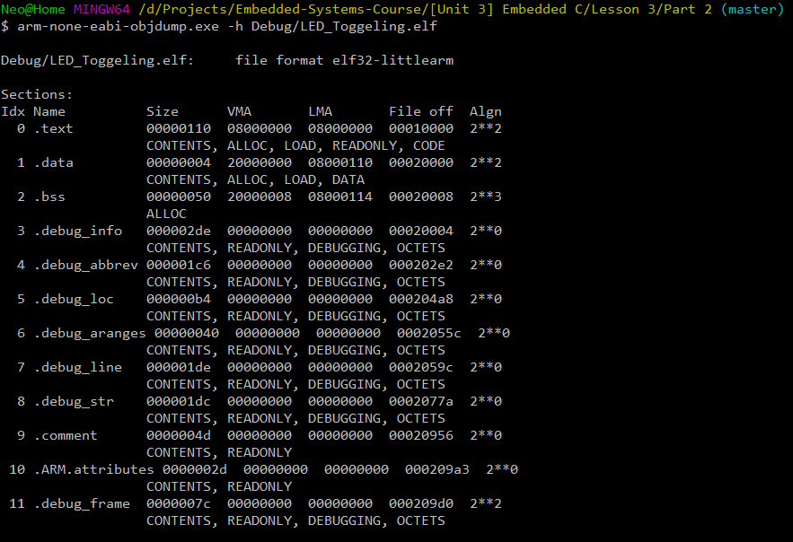
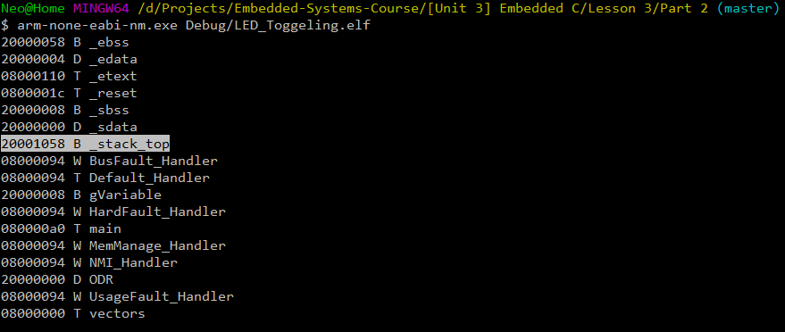
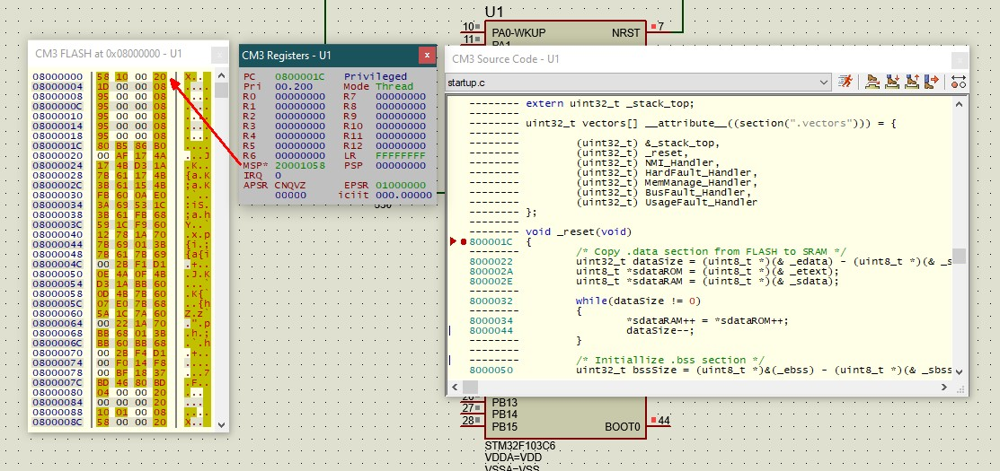
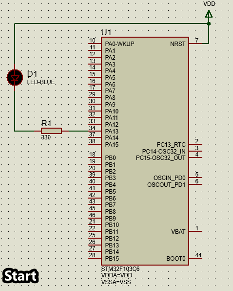

# Lab 3 - Part 2: Writing a startup file in C

* In this lab we are going to use the same files from [Part 1](https://github.com/amosultan/Embedded-Systems-Course/tree/master/%5BUnit%203%5D%20Embedded%20C/Lesson%203/Part%201) of this lab but we are going to wirte the startup in C language instead of assembly this time.
* This is only possible due to the fact that the Cortex-M3 architecture uses the first address in flash to store a value that is going to be fetched into the Sp register on power on and reset.

---

## Dependencies

* [GNU Arm Embedded Toolchain](https://developer.arm.com/tools-and-software/open-source-software/developer-tools/gnu-toolchain/gnu-rm)
* [GNU make](https://www.gnu.org/software/make/)

---

## Simulation and Analyzing the .elf  output file

* We can check the different memory sections in the final .elf file using GNU arm toolchain binary utilities like:
    1. objdump: to check the different memor sections with their statring addresses and sizes. 
    2. nm to check the symbol table of the final .elf file.

* For example:

```bash
arm-none-eabi-objdump.exe -h Debug/LED_Toggeling.elf
```


```bash
arm-none-eabi-nm.exe Debug/LED_Toggeling.elf
```


* Notice how that the stack top symbol too the address 0x20001058 after the location counter calculation in the linker script.

* And to verfiy that this address will be the first address in memory we simulate the .elf file on proteus.



* And as usual here is the simulation working as expected.

