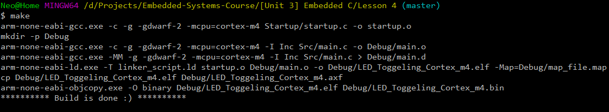

# Lab 4: LED toggling with Coretx-M4 based micro-controllers

In this final lab of the embedded c unit we are going to:
* build the same led toggling example but this time for the Tiva C development board which has a cortex-m4 processor.
* Debug the code on Keil IDE.
*  And finally run the code on the physical board.

---

## Dependencies

* [GNU Arm Embedded Toolchain](https://developer.arm.com/tools-and-software/open-source-software/developer-tools/gnu-toolchain/gnu-rm)
* [GNU make](https://www.gnu.org/software/make/)

---

## Build

The Makefile was modified to match the cortex-m4 and to output the right extension for Keil IDE.

---

## Simulation on Keil IDE

The following gif shows the signal on pin 3 of portf using the logic analyzer embedded in the Keil IDE debugger.

---

## Runing the code on the physical board

And finally here is a link to a video showing the code running on the actual bored.

[Video Link](https://drive.google.com/file/d/15nPoRo0yCUZeJ0dRVaRC7FxFBR3quFte/view?usp=sharing)